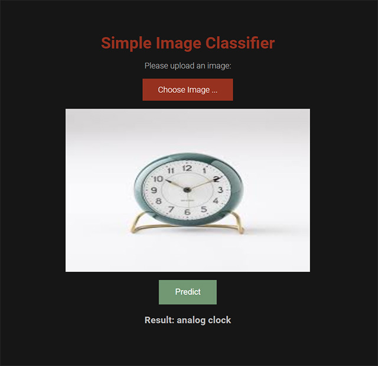
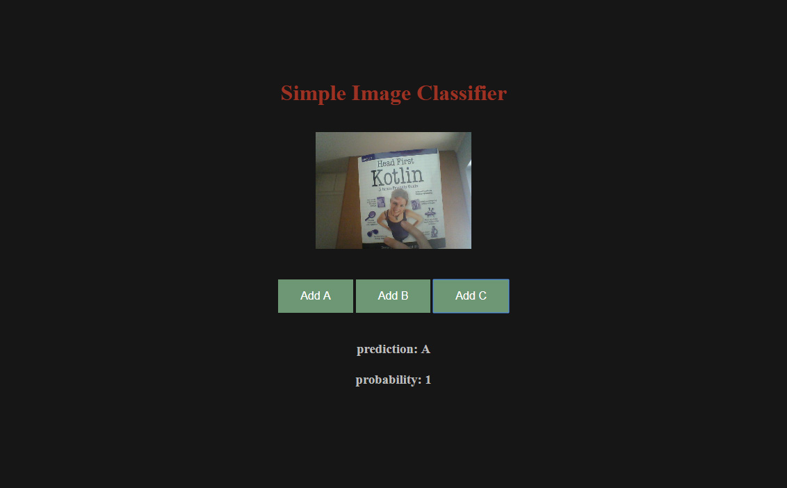

# Simple-Image-Classifier-with-Tensorflow.js

Simple Image Classifier Project consists of **two** web apps. The first one classifies the image that the user uploads. The second one, supports training of the model with images the user provides using his/her webcam.

* It uses Tensorflow.js libary

* It allows you to **train** the model using your webcam

* The training runs locally, on your computer!

# First App - Single Image Classification

Simple Image Classifier is a Simple AI web app. It allows you to classify an image that you upload from your computer.

* It use Tensorflow.js libary

* It uses the **mobilenet** model for image classification

* The runs locally, on your computer!

* Live demo here: http://educ8s.com/ai/

  

# Second App - Web Camera Model Training and Classification

supports training of the model with images the user provides using his/her webcam.

* It uses Tensorflow.js libary

* It allows you to **train** the model using your webcam

* The training runs locally, on your computer!

  

